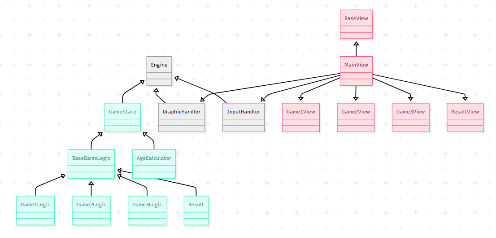

# Design architetturale

## Architettura complessiva
In seguito al completamento dell’analisi dei requisiti, il gruppo si è concentrato sulla progettazione del design architetturale del sistema.
Nell’immagine seguente è possibile osservare la struttura architetturale adottata.

In particolare, i componenti sono stati suddivisi secondo il pattern MVC (Model-View-Controller):
* **Model**: Contiene tutti i componenti che rappresentano la logica del gioco.
  - _MiniGameLogic_ trait base che definisce il contratto comune per la logica dei mini-giochi.
  - _MathMiniGameLogic_ trait che definisce il contratto comune per la logica dei mini-giochi matematici.
  - _AgeCalculator_ gestisce la logica relativa alla stima dell’età cerebrale.
  - _FastCalcLogic_, _CountWordsLogic_, _RightDirectionsLogic_ , _ColoredCountLogic_ and _WordMemoryLogic_ classi che 
  - implementano la logica dei diversi mini-giochi.
  - _Question_ ???
  - _QuestionResult_ ???

* **Controller**: Contiene i componenti che coordinano la comunicazione tra la logica e l’interfaccia grafica, 
  gestendo il flusso del gioco.
  - _GameController_ gestisce l’esecuzione dei mini-giochi, orchestrando il passaggio delle informazioni dal Model 
  alla View e viceversa.
  - _GameViewCallback_ interfaccia di callback utilizzata per aggiornare la View in base agli eventi generati dalla 
  logica di gioco.

* **View**: Contiene tutti i componenti che si occupano della rappresentazione grafica e dell’interazione con l’utente.
  - _MenuView_ schermata principale del gioco che viene mostrata all'avvio. 
  - _AgeTest_ rappresenta la vista dedicata al test dell’età cerebrale.
  - _Training_ gestisce la fase di allenamento, dove vengono proposti i mini-giochi.
  - _ResultsPanelFactory_ produce i pannelli per la visualizzazione dei risultati.
  - _GamePanelFactory_ produce i pannelli per la visualizzazione dei mini giochi.

Questa struttura architetturale ha permesso di mantenere un’elevata separazione delle responsabilità, migliorando la 
manutenibilità e l’estensibilità del sistema. 

## Descrizione di pattern architetturali usati
E’ stato scelto di utilizzare il pattern architetturale **MVC (Model View Controller)** per strutturare l’applicazione in modo modulare e manutenibile.

Il funzionamento di tale pattern, come evidenziato anche dall’immagine sottostante è il seguente:
* **Model**: Si occupa della gestione del dato e contiene tutta la logica del gioco. Può comunicare con la view solo attraverso il controller, non ha alcun collegamento diretto con essa.
* **View**: E’ responsabile della rappresentazione grafica dei dati e dell’interfaccia utente. Comunica con il controller per ottenere dati dal model.
* **Controller**: E’ il componente che fa da ponte tra il Model e la View. Riceve l’input dall’utente attraverso la View, elabora queste informazioni comunicando con il Model e aggiorna la View per riflettere il cambiamento di stato.

[Torna all'indice](index.md)