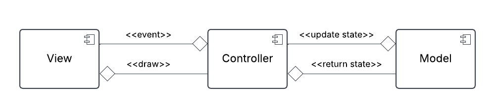

# Design architetturale

## Architettura complessiva

Dopo aver analizzato i requisiti richiesti, è stata svolta la fase di progettazione del design architetturale del
sistema. Nello specifico, è stato scelto di utilizzare un architettura basata su **MVC (Model View Controller)**.

Nello specifico, il funzionamento è il seguente:

* **Model**: gestisce la logica del gioco e la sua evoluzione
* **View**: crea le interfacce grafiche per fornire all'utente delle schermate sullo stato del gioco
* **Controller**: è il punto di incontro tra logica e grafica, gestisce il *game loop* e i tempi di gioco

## Descrizione di pattern architetturali usati

## Scelte tecnologiche cruciali ai fini architetturali

[Torna all'indice](index.md)