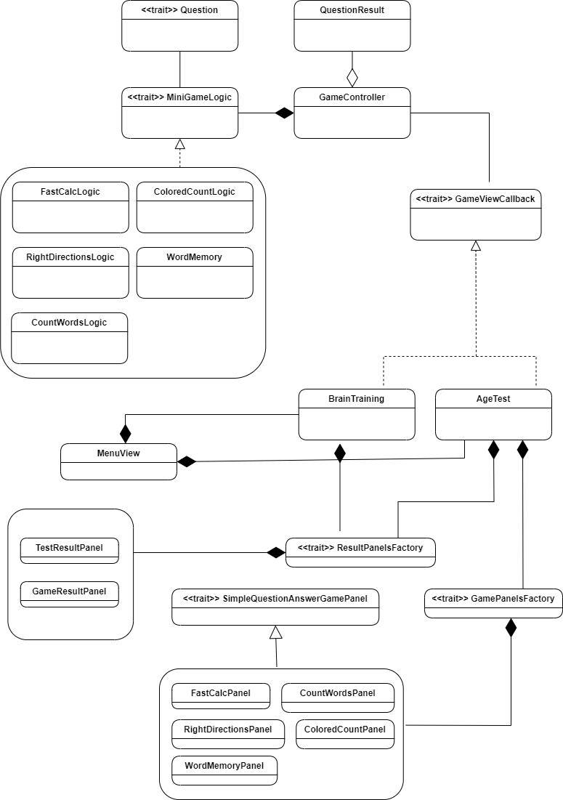

# Design architetturale

## Architettura complessiva
In seguito al completamento dell’analisi dei requisiti, il gruppo si è concentrato sulla progettazione del design architetturale del sistema.
Nell’immagine seguente è possibile osservare la struttura architetturale adottata.

In particolare, i componenti sono stati suddivisi secondo il pattern MVC (Model-View-Controller):
* Componenti in verde (**Model**): rappresentano la logica del gioco.
  - _BaseGameLogic_ funge da classe base per la logica di tutti i minigiochi, permettendo di applicare il principio DRY (Don't Repeat Yourself) e facilitando lo sviluppo in modo modulare e guidato.
  - _AgeCalculator_ implementa la logica per la stima dell’età cerebrale.
  - Le classi _Game1Logic_, _Game2Logic_ e _Game3Logic_ estendono la logica di base per gestire il comportamento specifico di ciascun minigioco.
  - _GameState_ gestisce lo stato corrente del gioco, condiviso tra le componenti logiche (es. punteggio, tempo...)
  - _Result_ contiene le informazioni finali da visualizzare all’utente.

* Componenti in grigio (**Controller**): coordinano la comunicazione tra la logica e l’interfaccia grafica.
  - _Engine_ è il cuore del controller e gestisce il ciclo di esecuzione del gioco, orchestrando l’interazione tra input, logica e interfaccia.
  - _InputHandler_ e _GraphicHandler_ sono classi specializzate che si occupano rispettivamente della gestione degli input utente e del rendering grafico.

* Componenti in rosso (**View**): si occupano della rappresentazione grafica e dell’interazione con l’utente.
  - _BaseView_ è la classe base da cui derivano tutte le view.
  - _MainView_ funge da punto di accesso centrale per la visualizzazione, da cui derivano e vengono gestite:
    - _Game1View_, _Game2View_, _Game3View_: interfacce specifiche per ciascun minigioco.
    - _ResultView_: schermata di visualizzazione del risultato finale.

Questa struttura architetturale ha permesso di mantenere un’elevata separazione delle responsabilità, migliorando la manutenibilità e l’estensibilità del sistema. 

## Descrizione di pattern architetturali usati
E’ stato scelto di utilizzare il pattern architetturale **MVC (Model View Controller)** per strutturare l’applicazione in modo modulare e manutenibile.

Il funzionamento di tale pattern, come evidenziato anche dall’immagine sottostante è il seguente:
* **Model**: Si occupa della gestione del dato e contiene tutta la logica del gioco. Può comunicare con la view solo attraverso il controller, non ha alcun collegamento diretto con essa.
* **View**: E’ responsabile della rappresentazione grafica dei dati e dell’interfaccia utente. Comunica con il controller per ottenere dati dal model.
* **Controller**: E’ il componente che fa da ponte tra il Model e la View. Riceve l’input dall’utente attraverso la View, elabora queste informazioni comunicando con il Model e aggiorna la View per riflettere il cambiamento di stato.

[Torna all'indice](index.md)