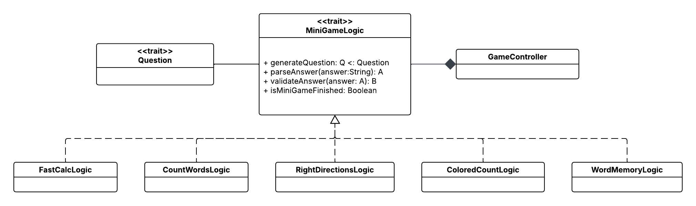
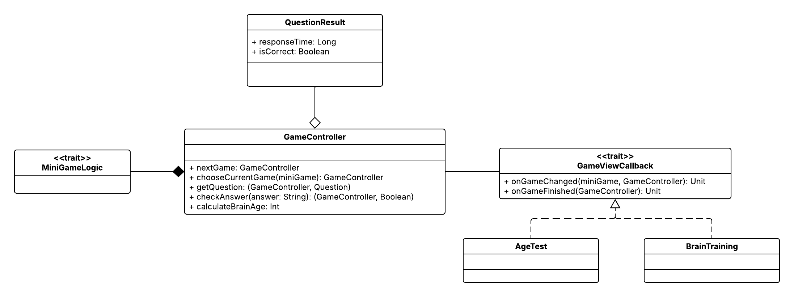

# Design di dettaglio

## Scelte rilevanti di design

Come detto precedentemente, la scelta rilevante del progetto è relativa all'uso del pattern *MVC*. Questa decisione
ci ha permesso di tenere separata la logica dalla grafica, rendendo così il codice facilmente modificabile
ed estendibile nel futuro. Inoltre, il progetto prevede un'architettura modulare dove ogni funzionalità del sistema
è racchiusa in un modulo. Infine, il *controller* rappresenta il punto centrale del progetto in quanto incapsula
lo stato attuale del gioco, andando così a garantire coerenza tra le diverse viste.

## Pattern di progettazione

### Model

Per lo sviluppo delle logiche dei mini-giochi è stato usato il pattern *Strategy*. Infatti, tutti i mini-giochi
aderiscono al contratto *MiniGameLogic* e poi, ognuno di loro, implementerà i propri metodi in base alle regole
del mini-gioco. Le funzioni fondamentali di ogni mini-gioco sono:
- generare nuove domande
- fare il *parsing* delle risposte dell'utente
- controllare le risposte dell'utente
- controllare quando il mini-gioco è finito

### View
La view si occupa di gestire i pannelli di gioco e di mostrare i risultati in base alla modalità di gioco scelta. 
All'interno della view abbiamo utilizzato i seguenti pattern:
* **Factory Method** 
* **Template Method** 
* **Observer**
* **Singleton**

All'avvio viene mostrato il menù principale (_MenuView.scala_) che permette di scegliere una delle modalità di gioco tra
Age Test e Brain Training oppure di consultare le regole del gioco.

_AgeTest.scala_ e _BrainTraining.scala_ sono le classi che rappresentano le due modalità di gioco: 
* Nel caso di Age Test, vengono mostrati tre mini-giochi estratti casualmente in sequenza. Al termine viene calcolata e 
mostrata la stima dell'età cerebrale.
* Nel caso di Brain Training, l'utente può scegliere un mini-gioco su cui allenarsi e, al termine, visualizzare i 
risultati (risposte corrette, errate e tempo impiegato).

Entrambe le classi, creano i pannelli dei mini giochi e dei risultati utilizzando le rispettive **factory** _GamePanelsFactory_ 
e _ResultPanelsFactory_.
Lo scopo principale di queste factory è creare e restituire pannelli già configurati e pronti all'uso.
Inoltre _AgeTest.scala_ e _BrainTraining.scala_ contengono anche metodi che si occupano di reagire a eventi come _onGameFinished_ e 
_onGameChanged_, implementando quindi il **pattern Observer**.

Ciascun mini gioco dispone di un panel dedicato, che estende il trait _SimpleQuestionAnswerGamePanel.scala_: in questo caso è stato 
adottato il pattern **Template Method**, poiché il trait definisce il comportamento comune a tutti i pannelli, 
consentendo alle sottoclassi di ridefinire o personalizzare solo le parti necessarie, evitando duplicazioni di codice.

Infine, l’object _UIHelper_ rappresenta un esempio di **Singleton**, poiché incapsula in un’unica istanza la logica di creazione 
e gestione di componenti UI comuni. In questo modo si ottiene una centralizzazione delle utility grafiche, rendendo il 
codice più pulito e riutilizzabile.

### Controller

Il controller si occupa di gestire l'andamento del gioco facendo collaborare la logica e la grafica. La comunicazione
con la logica viene fatta attraverso la collezione di logiche del tipo *MiniGameLogic* (implementato tramite il
pattern *Strategy* visto prima). La comunicazione con la grafica, invece, viene fatta tramite il trait 
*GameViewCallback*. Questo contratto viene implementato dalle *view* in modo che, quando il controller produce un
nuovo evento potrà richiamare direttamente i metodi del trait. I due eventi previsti sono:
- **onGameChanged** che si verifica quando un mini-game è finito e si passa al successivo
- **onGameFinished** che si verifica quando il gioco (che sia Age Test o Brain Training) è finito

Infine, il controller tiene traccia delle risposte dell'utente salvandole in una collezione di *QuestionResult*.

## Organizzazione del codice

Il codice è stato diviso in *package* in base alle funzionalità. Nello specifico, il progetto presenta quattro moduli:

- **utils**: contiene costanti, funzioni ed *enum* utili per due o più file diversi
- **models**: contiene tutte le logiche del progetto, sia quelle dei mini-giochi e sia quelle del calcolo dei risultati
- **views**: contiene tutte le grafiche del progetto, dai menu di gioco fino ai pannelli dei mini-giochi
- **controllers**: contiene il controller del gioco e le classi/funzioni usate da esso

[Torna all'indice](index.md) 