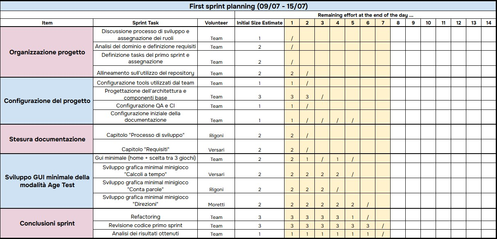

# Retrospettiva
Come già anticipato nei capitoli precedenti, il gruppo ha utilizzato un processo di sviluppo SCRUM like. 
Abbiamo cercato di suddividere il carico di lavoro in 4 sprint da 15 ore ciascuno come suggerito dalle regole d'esame. 
Segue la descrizione dettagliata dell'andamento del processo di sviluppo e dei vari sprint planning che sono stati seguiti 
nel corso dello sviluppo. 

## Andamento dello sviluppo
Ogni sprint è durato circa 7 giorni, a esclusione dell'ultimo che abbiamo spalmato su più giorni per motivi organizzativi. 
Al termine di ciascuno sprint abbiamo fatto una release in cui fosse visibile per gli stakeholders il risultato prodotto 
nel corso dello sprint, in particolare: 
* Primo sprint: ci siamo dedicati all'organizzazione iniziale del progetto, alla stesura della documentazione iniziale e
allo sviluppo di una GUI minimal che comprendeva la schermata di menù iniziale e le tre GUI per i mini giochi che avevamo 
in programma di sviluppare nello sprint successivo (Fast Calc, Count Words e Right Directions).

* Secondo sprint: in questa fase l'obiettivo principale era lo sviluppo dei primi tre mini giochi, in particolare dei 
test e della logica. Abbiamo inoltre collegato lo sviluppo dello sprint precedente a quello dello sprint corrente creando 
una prima versione del controller che permettesse lo scambio dei dati tra logica e view.

* Terzo sprint: in questo sprint ci siamo dedicati al completamento del controller, allo sviluppo di altri due 
mini giochi e al completamento del gioco Right Directions.

* Quarto sprint: l'ultimo sprint è quello che ha richiesto maggiore tempo in quanto oltre a terminare lo sviluppo, 
fare qualche correzione e molte operazioni di refactor, abbiamo avuto qualche problema con un bug relativo al mancato aggiornamento 
della lista dei risultati tra un mini gioco e l'altro che comprometteva la correttezza del calcolo della stima dell'età 
celebrale. 

Maggiori dettagli relativi al contenuto delle release sono stati già inseriti nei file contenuti nella folder process. 

## Commenti finali
In generale ci riteniamo soddisfatti del lavoro svolto, pensiamo di aver gestito abbastanza bene i tempi e di aver reagito 
e affrontato bene i problemi sorti nel corso dello sviluppo. 
Inoltre tutte i requisiti obbligatori sono stati rispettati e sono verificabili. 
Non abbiamo avuto tempo per lo sviluppo dei requisiti facoltativi in quanto abbiamo preferito concentrarci maggiormente 
sul refactor e sulla cura dei dettagli finali. 
Il risultato rispetta le nostre aspettative iniziali e permette l'aggiunta futura di ulteriori mini giochi. 

[Torna all'indice](index.md)