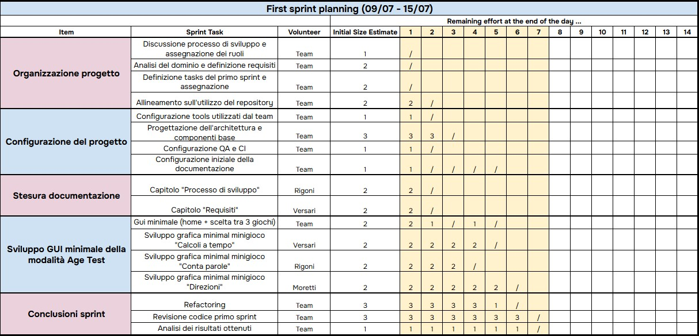

# Primo sprint

Il team si è incontrato da remoto tramite chiamata Teams per rivedere le specifiche del progetto e definire i
task del **primo sprint**.

- **Durata incontro:** 2 ore
- **Periodo sprint:** dal 09/07/2025 al 15/07/2025

## Obiettivi dello sprint

- Setup del progetto con le tecnologie previste (*IntelliJ*, *Git* e *GitHub*)
- Configurazione del modello di lavoro (*Git Flow*)
- Configurazione dei modelli di *Quality Assurance* (Scalafmt, Wartremover e Scalatest) e di *Continuous Integration*
  (GitHub Pages)
- Sviluppo di GUI minimali tra cui:
    - Home con scelta tra *Brain training* e *Age test*
    - Mini-game *Fast Calc*
    - Mini-game *Count Words*
    - Mini-game *Right Directions*

## Divisione del lavoro

## Sprint review

**Risultati ottenuti:**

- Completato il setup del progetto
- Completato il setup del modello di lavoro
- Create le GUI

Il codice prodotto nel primo sprint è stato incluso
nella [release 0.1.0](https://github.com/LorenzoRigoni/PPS-25-BTS/releases/tag/v0.1.0).