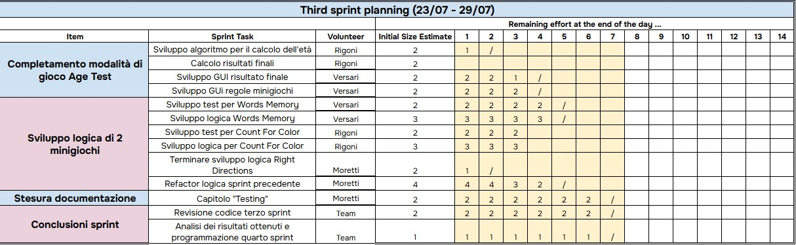

# Terzo sprint

Il team si è incontrato da remoto tramite chiamata Teams per definire i task del **terzo sprint**.

- **Durata incontro:** 2 ore
- **Periodo sprint:** dal 23/07/2025 al 29/07/2025

## Obiettivi dello sprint

- Sviluppo algoritmo per il calcolo dell'età in *Age test*
- Sviluppo GUI risultato finale e regole dei mini-games
- Sviluppo test e logica di due nuovi mini-games (*Words Memory* e *Colored Count*)

## Divisione del lavoro

## Sprint review

**Risultati ottenuti:**

- Completato modalità *Age test* con calcolo dell'età mentale
- Create GUI per risultato finale e regole
- Creati test e logiche per i due nuovi mini-games

Il codice prodotto nel terzo sprint è stato incluso
nella [release 0.3.0](https://github.com/LorenzoRigoni/PPS-25-BTS/releases/tag/v0.3.0).